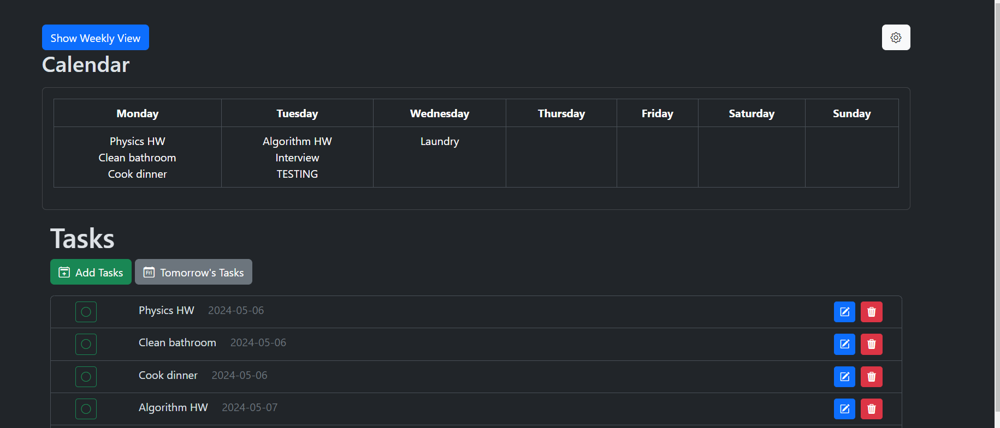

# To Do List  



## Running on Windows:
1. open powershell 

2. Install the python packages 
    ```shell 
    cd todolist-app
    python -m venv venv
    .\venv\Scripts\Activate.ps1
    pip install -r requirements.txt
    ```

    if you get an error when trying to activate then open powershell as an admin and run
    `Set-ExecutionPolicy Unrestricted -Force`

3. Run the python server 
    ```shell
    python server.py
    ```

4. open http://127.0.0.1:5000

5. 
    ```shell
    deactivate
    ```
    
## Running on Mac:
1. open terminal

2. Install the python packages
   ```shell
   cd todolist-app
   python -m venv venv
   source venv/bin/activate
   pip install -r requirements.txt
   ```

3. Run the python server
   ```shell
   python server.py
   ```

4. open http://127.0.0.1:5000

5. ```shell
   deactivate
   ```

## Activating Google API
1. Create a Google cloud project: 

2. Enable Google Calendar API

3. Configure OAuth Consent screen
   
4. Authorize credentials for desktop application
   
5. Download credentials.json file to the Google cloud project and add it to the db directory

Resources:  
Creating a google cloud project: https://developers.google.com/workspace/guides/create-project  
Configuring project/API: https://developers.google.com/tasks/quickstart/python
